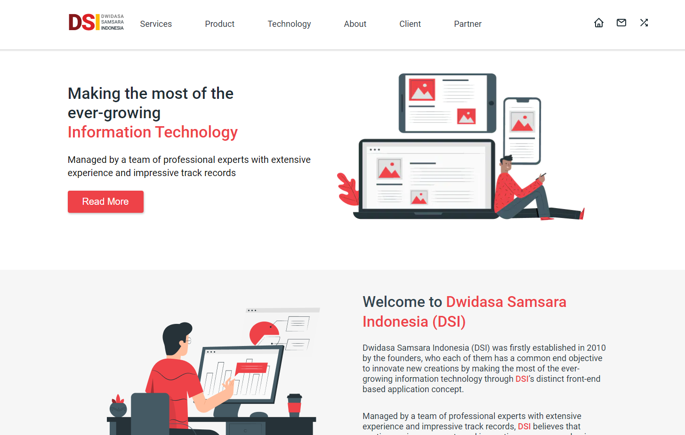

  

## DSI

<h4 align="center">
  Esse projeto eu peguei o design dele no Figma para praticar e tentar recriar as telas.
  O link para o design vou deixar abaixo.
</h4>

  <a href="https://letmeask-nlw-781b6.firebaseapp.com/">Demostração</a>

 

## Tecnologias
No projeto foram utilizados:
- [NextJS](https://nextjs.org/)
- [Storybook](https://storybook.js.org/)
- [React Testing Library](https://testing-library.com/docs/react-testing-library/intro)
- [Jest](https://jestjs.io/)
- [Prismic CMS](https://prismic.io/)
- [TypeScript](https://www.typescriptlang.org/)
- [Styled Components](https://styled-components.com/)
- [GraphQL](https://graphql.org/)
- [Apollo](https://www.apollographql.com/)
- [Eslint](https://eslint.org/)
- [Prettier](https://prettier.io/)
- [Husky](https://github.com/typicode/husky)

## Layout
Você pode visualizar o layout do projeto <a href="https://www.figma.com/file/HoefLsyDjVvh2vycnmlAwu/DSI-Web-Landing-Page-Redesign-Community?node-id=1%3A2" target="_blank">clicando aqui</a>.
